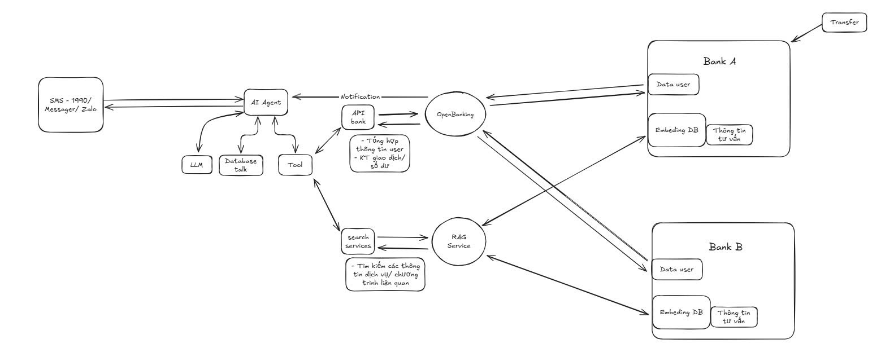

# Agentic SMS Finance — Multi‑Service Project (RAG + Open Banking)

> Trợ lý tài chính AI qua SMS & Microservices — Giải pháp dự thi Hackathon HDBank 2025.  
> Kết hợp **AI Agentic Planning (Gemini)** + **Local Reasoning (Ollama)** + **Vector RAG (Milvus)** + **Open Banking Hub**.

---

## 🚀 Ý tưởng & Giá trị

Người dùng chỉ cần nhắn tin SMS (hoặc chat app) để:
- 📊 Xem **số dư & giao dịch** an toàn (OTP / xác thực đa kênh).
- 🏦 Truy xuất thông tin tài khoản từ những kênh được kết nối
- 💳 Tìm kiếm **dịch vụ ngân hàng** (thẻ tín dụng, vay, tiết kiệm…) qua RAG semantic search.
- 🔔 Nhận cảnh báo số dư, chi tiêu, gợi ý tài chính.

**Điểm nổi bật**:
- **Agentic Multi-Service RAG**: Kết hợp nhiều dịch vụ ngân hàng với logic OTP + RAG.
- **Open Banking demo**: Hub đa ngân hàng, đa tài khoản, OTP giả lập qua WebSocket (giả SMS).
- **AI Planner**: Gemini ánh xạ ý định → gọi hàm (function call).
- **AI Synthesizer**: Ollama (LLaMA) tạo câu trả lời tự nhiên, ngắn gọn, tiếng Việt.
- **RAG Engine**: Milvus + SentenceTransformer cho tìm kiếm dịch vụ.

---


---

## 📂 Cấu trúc dự án

```
multi_service_agent/
├── banking_server/     # Hub Open Banking mock (Node.js)
│ ├── package.json
│ ├── data/
│ │   └── users.json    # Mock user + account data
│ └── server.js
├── agent_server/       # AI Agent (FastAPI + Gemini + Ollama)
│ ├── requirements.txt
│ ├── agent_app.py
│ ├── bank_tool.py
│ ├── config.py
│ ├── gemini_planner.py
│ ├── memory_manager.py
│ ├── ollama_wrapper.py
│ └── service.py
├── rag_service/        # RAG semantic search (Milvus + SBERT)
│ ├── requirements.txt
│ ├── docker-compose.yml
│ └── main.py
├── client/ # Streamlit demo UI
│ └── ui_client.py
├── docker-compose.yml  # Orchestration (Redis, Milvus, etc.)
└── .env.example # Config mẫu
```


## ⚙️ Cách chạy demo

### 1. Banking Server (mock Open Banking Hub)
```bash
   cd banking_server
   npm i 
   node server.js
```

Mặc định chạy ở: http://localhost:4000

REST API: /bank/:bank/accounts/:phone, /bank/:bank/balance…

WebSocket giả SMS: ws://localhost:4000/ws?phone=demo:thao

### 2. Ollama LLM (local reasoning)
Cài Ollama và chạy:

>ollama run llama3:8b

### 3. Agent Server (Gemini + Ollama + OTP logic)
```bash
cd agent_server
pip install -r requirements.txt
uvicorn agent_app:app --reload --port 8000
```


Mặc định chạy ở: http://localhost:8000/ask


### 4. RAG Service (Milvus + SBERT)
```bash
cd rag_service
docker compose -f docker-compose.yml up --build -d
uvicorn main:app --host 0.0.0.0 --port 8002 --reload
```

Milvus UI (Attu): http://localhost:8001

RAG API: http://localhost:8002/rag/search


### 5. Client UI (Streamlit)
```bash
cd client
streamlit run ui_client.py --server.port=8501
```


**UI gồm:**
* Chat với Agent
* Banking OTP Flow
* SMS Inbox (giả lập OTP qua WebSocket)


